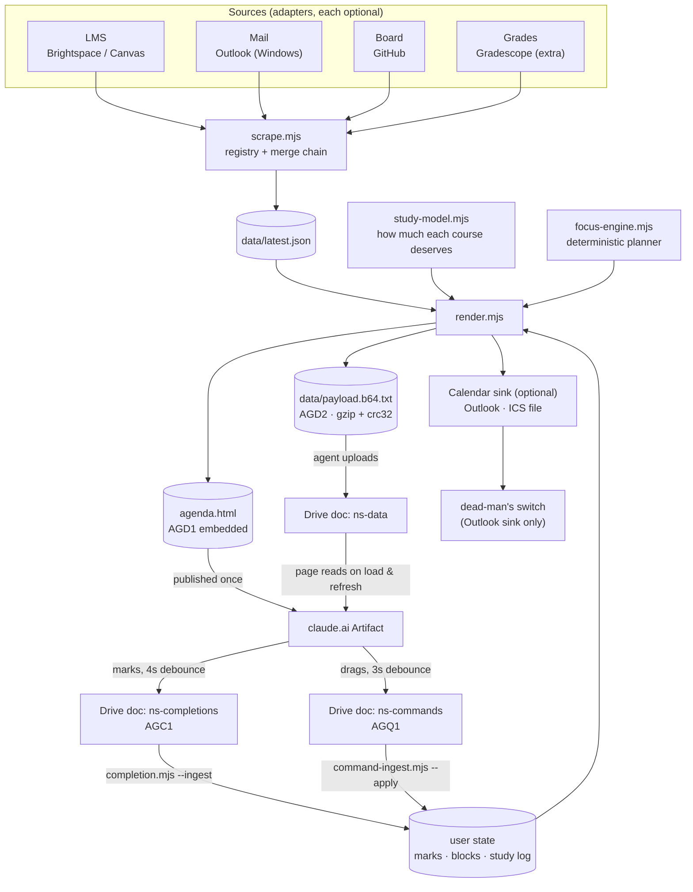

# Architecture

How the agenda actually works, in about ten minutes of reading.

The one-sentence version: **deterministic scripts decide everything, a language
model only triages and describes, and the page in your pocket talks back through
a Google Doc.**

---

## The diagram

---

## The two lanes

There are exactly two kinds of run, and they exist because scraping is slow and
the phone is impatient.

| | **Heavy run** | **Light sync run** |
|---|---|---|
| **How often** | Twice a day | Every two hours, in waking hours |
| **Budget** | Ten minutes, occasionally more | **Two minutes** |
| **Scrapes?** | Yes — everything | **Never** |
| **Writes descriptions?** | Yes, for new items only | No |
| **Mirrors state?** | Yes | No |
| **Email?** | The morning digest, at most one | **Never** |
| **Push?** | At most one | At most one, and zero is expected |
| **Runbook** | `runbooks/heavy-run.md` | `runbooks/sync-run.md` |

The light lane exists for one reason: **a mark the user saves at 14:00 should not
have to wait until the evening to show up on their own page.** It picks up
commands and completions from Drive, re-runs the model and the planner,
re-renders, re-publishes, and stops. It is not a small version of the heavy run —
it deliberately cannot scrape, so it can never be slow and can never fail on
authentication.

**Both lanes are non-fatal step by step.** A run that finishes with six
`SKIPPED` tokens is a success. A run that dies in the middle and writes nothing
is the only real failure. That is why the last step of every runbook is "write
the log line", and why an agent is told to reach it even when it is stopping
early.

---

## Sources are adapters, and every one is optional

`src/connectors/` holds one module per source, each implementing the contract in
`docs/EXTENDING.md`. `src/connectors/index.mjs` is a **static** registry — an
explicit import list, no dynamic globbing — so the whole set is analysable and
the dependency count stays at zero.

Six modules ship: `lms-brightspace`, `lms-canvas`, `mail-outlook`,
`calendar-outlook`, `calendar-ics`, `board-github`, plus the `grades-gradescope`
shim. Everything except Brightspace ships disabled.

A connector runs if and only if:

1. the block at its `meta.configPath` has `enabled === true`, **and**
2. every `meta.requires` entry is satisfiable on this machine — the operating
   system, executables on `PATH`, MCP server keys.

`configPath` usually mirrors the kind, with one standing exception:
`kind: "calendar-sink"` lives under `connectors.calendar.<provider>`. There is no
`connectors.calendar-sink`.

A connector that is enabled but unsatisfiable produces **one** `errors[]` line
and is otherwise a no-op. It never fails the run.

**The only hard requirement is that one `kind: "lms"` source is enabled and
configured.** Either or both of Brightspace and Canvas is fine. Without one there
is nothing to build an agenda from, and `scrape.mjs` exits 1 with a message
rather than a stack trace; the preflight fails on the same condition.

`connectors.materials` is **not** part of this layer — it is a flat config block
driving the standalone `src/materials-sync.mjs`, with no provider level and no
adapter.

Why this layer exists at all: mail and calendar on Windows need a locally running
desktop program, which macOS users and cloud environments cannot have. If those
were hard dependencies, this template would be Windows-only. Making every source
swappable is what makes a Mac or hosted-connector configuration possible.

---

## The merge chain

`scrape.mjs` collects `items / mail / announcements / board / grades / errors`
from every enabled source, then runs one fixed chain:

1. **`dedupe`** — the same deliverable arrives from several sources (a dropbox
   entry, a syllabus line, an email). One item, `sources: [...]` recording all of
   them.
2. **`reconcileApprox`** — an item whose date was *estimated* from prose gets
   replaced when a real date turns up. Estimated dates carry `approx: true` and
   the page shows them with a `~`.
3. **`collapseCalendarTwins`** — some LMS endpoints emit two rows for one thing,
   an "opens" and a "closes". The corroborated row wins; exams keep the earliest
   twin, because that is the session.
4. **`applyGrades`** — a gradebook entry that matches by title with points above
   zero is positive evidence, and sets `submitted: true`.
5. **`applyGradescopeStatus`** — the same overlay for the optional external
   grading service, matched on course plus fuzzy title, **deliberately ignoring
   the due date and the source.** That is what closes an item born from an email:
   an instructor announces "Hw1" by mail, the user submits "Homework 1"
   elsewhere, and the item closes.

Title matching is strict about numbers on purpose: `HW1` matches `Homework 1`,
and `HW 1` does **not** match `HW 11`.

The output is `data/latest.json`, plus `previous.json` and `diff.json` — the
diff is what the notification rules read.

---

## Deciding what matters

Two modules, in this order, both deterministic and both unit-tested.

### `study-model.mjs` — how much each bucket deserves

Scores every course and bucket 0–5, blending:

- a **difficulty prior** from `config.difficulty` (**0 is a veto** — a bucket at
  0 never gets time, which is what the zero-work seminar is for)
- a **grade signal**
- **exam or sitting proximity** inside 14 days
- **open backlog**
- **observed pace** from the study log — minutes per finished task, so a log
  entry can never inflate a course on its own
- a **boost for courses the user does not attend** (`schedule.attend: false`),
  because self-study is replacing the lecture
- a **board term** for the side-project bucket

Every bucket explains itself in `courses.<bucket>.evidence[]`, in plain strings.
That is deliberate: an unexplained weight is one nobody can argue with, and a
planner nobody can argue with is one people stop reading.

### `focus-engine.mjs` — the planner

Takes those weights and produces seven days of blocks, each with a local start
time and a length. It:

- **never schedules before `config.wakeTime`** — a hard floor, not a preference
- **never books over a class the user attends** (`schedule.attend: true`)
- splits the daily budget in proportion to weight times urgency, rounds to
  15-minute steps, and never emits a block shorter or longer than the configured
  bounds
- **may come in under budget; never over**
- **pins blocks the user dragged** and packs everything else around them
- **learns** from the drag history — after the *same* course has been edited
  twice, clamped hard

**Pinned minutes come off the day's budget before anything else is sized**, so a
four-hour pin legitimately leaves that day with one block. That is the user's
arithmetic, not a bug.

Where the timetable is blank, block times are **advisory** — the engine is
placing work in hours it has no evidence about. Nothing in this system ever tells
the user they are "free" at a given hour.

### `behind.mjs` — the verdict

Seven rules, ranked worst-first, producing exactly one of `clear`, `notice` or
`behind`. It reads only local JSON, writes nothing, sends nothing, and **always
exits 0** — a verdict is not an error.

It explicitly **refuses to treat `submitted === false` as a trigger.** An item is
named because *nothing says it is done*, never because *something says it is
not*. See `docs/design-notes/data-truth.md`.

---

## The page, and the four documents

`render.mjs` produces two things from one payload:

- **`agenda.html`** — the page with a **plain** `AGD1.` envelope embedded, so it
  paints instantly and works with no network at all.
- **`data/payload.b64.txt`** — the same payload as a **gzipped, CRC-guarded**
  `AGD2.` envelope, which an agent uploads to Drive.

You publish `agenda.html` once as a Claude Artifact. From then on the page
**fetches its own data** from a Google Doc on load and on refresh, which is what
makes it live on a phone without republishing anything.

Four documents, four exact titles, three owners:

| Title | Written by | Read by |
|---|---|---|
| `<ns>-data` | a run, from `payload.b64.txt` | the page |
| `<ns>-mirror` | a heavy run, from `backup.b64.txt` | nothing — it is insurance |
| `<ns>-completions` | **the page**, when you tick something | `completion.mjs --ingest` |
| `<ns>-commands` | **the page**, when you drag a block | `command-ingest.mjs --apply` |

### Every Drive write is create-then-trash, in that order

**`update_file` on this connector is metadata-only.** It cannot replace a
document's body. So the only way to publish new content is `create_file`, then
`trash_file` on the older documents of the same title, **matched by id.**

Create first, trash second, **always**:

- If the create fails and you trashed first, the page is now reading nothing.
- If the create fails and you trashed nothing, the page keeps reading the
  document that is already there, one cycle stale. Which is fine.

And never across titles. Trashing a `<ns>-completions` document while rotating
`<ns>-data` destroys a mark the user made, and nobody will ever know it happened.

**The page only ever creates. It never trashes anything.** Cleanup is a
pipeline job, because only the pipeline knows what it has consumed.

### Why the payload is compressed

The agent has to *type* the payload into a document — there is no upload API in
this path, so the model is unavoidably the byte transport. An uncompressed
payload was about 65,000 base64 characters: roughly 185k tokens to read and 185k
more to emit, which is past a context window. Runs failed.

Gzip before base64 on JSON with highly repeated keys compresses about six times.
With the slim tiers on top, a run's upload is around **6,700 characters — a
>9× reduction** that fits in one message with room to spare.

The CRC-32 exists because the realistic corruption mode is a truncated or
mistyped transcription, and **a truncated gzip stream can still start
decompressing** — so without a checksum a torn payload would produce plausible
partial data instead of an error.

Full spec: `docs/PROTOCOL.md`.

---

## Talking back from the phone

The page writes two kinds of document, both small, both plain (no compression —
the page writes them directly through a tool call, so no model is in that path).

**Marks** (`<ns>-completions`, `AGC1.`). Ticking a card closes the
**deliverable**. Ticking a study block closes **that session** — one block, on
one day — and leaves the assignment, its other blocks and its deadline chip
alone. Those are different keys in different key spaces, and conflating them was
a real bug: one finished study session checking off an entire assignment.

Unticking writes a **tombstone** rather than deleting anything. Tombstones are
republished in the payload's `done[]` as `state: "cleared"` — without that, a
browser's local storage would resurrect a revoked mark forever.

**Commands** (`<ns>-commands`, `AGQ1.`). Seven operations: `defer`, `add`,
`note`, `logstudy`, `attending`, `snooze`, `block`. Fail-closed, two-phase
validation: **either every operation in a document applies, or none does.** An
exam may not be deferred; a defer may only ever move a date *later*, so it can
silence an alert but never invent one.

`command-ingest.mjs` is the **only** writer of `data/block-edits.json`. The
planner only reads it. That one-way street is what makes a drag stick.

**Completion is not on the command bus.** An op of `done` is refused by name.
One door for "it is finished", forever.

---

## The three watchdogs

Every alarm assumes the run happens, and happens well, so three independent
things watch for the cases where it does not:

- **`stale-check.mjs`** runs *inside* the machine, on logon, unlock, resume and
  every 30 minutes. It catches a machine that was merely **asleep** at a
  boundary, and starts the missed scheduled task.
- **`deadman.mjs`** plants a calendar event 26 hours out through the **Outlook**
  sink, deleted and replanted by every successful run. It catches a machine that
  is **gone**, and it fires from a calendar service rather than from the machine
  that stopped.
- **`auth-retry.mjs`** runs inside the machine on the same triggers, hourly, and
  asks a different question: not *"did a run happen?"* but *"can we still log
  in?"*. It catches the case the other two are **right** to ignore — a run that
  fired exactly on time, hit an expired session, spent its one permitted re-auth,
  and stopped. That run happened and that machine is alive, so neither of the
  others has anything to say, and without this lane the retry interval for a
  broken login is the gap to the next heavy run.

Each one's blind spot is another one's purpose.

The auth lane is free on a healthy machine: it fires a login only when there is
no session file at all, or the session is unusable **and** the newest failure is
newer than the newest success. An expired session with nothing outstanding is the
resting state between runs and is left alone.
It stops permanently on a rejected password — retrying one an institution has
already refused is how a stale agenda becomes a locked account — and where the
second factor is number matching it relays the number the instant it appears,
because a prompt nobody can see was never answerable at all.

**The second one is Windows-only, and there is no substitute.** It has to ring
from something that is not this machine, and the ICS sink writes a file on the
machine that stopped. Everywhere else, every run logs
`deadman=SKIPPED(no-calendar-sink)` — expected, not a fault, and it does mean the
off-machine watchdog is unarmed. `docs/design-notes/watchdogs.md` has the whole
argument.

---

## Why the pipeline is deterministic and the LLM only triages

Every number on the page comes from a script a unit test can pin down. That is
not an aesthetic preference; it buys four specific things:

1. **The same input produces the same output.** Demo mode is byte-reproducible
   at a fixed instant, so its output can be diffed.
2. **A wrong number is a bug with a location.** "The weight is wrong" points at
   `study-model.mjs` and its evidence strings, not at a prompt.
3. **Cost and latency are bounded.** The two-minute sync lane is two minutes
   because almost nothing in it is a model call.
4. **Untrusted input cannot reach a decision.** Assignment titles and
   announcement bodies are written by other people. They flow into a *renderer*,
   not into a scheduler. A malicious string can appear on the page; it cannot
   change how much time a course gets.

What the model does, and only this:

- **Triage** — reading an email body and deciding it carries a real deadline
- **Describe** — writing the one-to-three sentences that make a card mean
  something
- **Transport** — moving the payload into Drive, because that path has no API
- **Report** — saying, in plain English, what changed

The model never computes a schedule, never decides whether the user is behind,
and never edits a number the pipeline produced.
